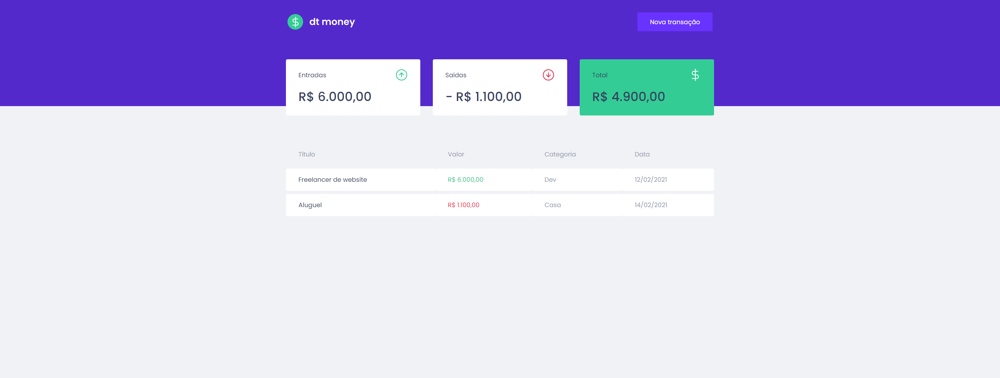

<h1 align="center">
  
</h1>


<h3 align="center">
  DtMoney - Finanças sob controle!
</h3>


<p align="center">
  <a href="https://rocketseat.com.br">
    
  </a>
</p>

<p align="center">
 <a href="#-sobre">Sobre</a> |
 <a href="#-requisitos">Requisitos</a> | 
 <a href="#-tecnologias">Tecnologias</a> | 
 <a href="#%EF%B8%8F-como-executar">Como executar</a> | 
 <a href="#-licença">Licença</a>
</p>


## 🚀 Sobre
<p align="center">
  
</p>

O dtmoney é uma aplicação de controle financeiro. Foi desenvolvida durante as aulas do Chapter II da trilha de ReactJS do Bootcamp Ignite da Rocketseat, e nela é possível cadastrar e excluir transações e ver o saldo de entrada e saída 💰

## 📚 Requisitos
- Ter [**Git**](https://git-scm.com/) para clonar o projeto.

## 🚀 Tecnologias
- [ReactJS](https://github.com/facebook/react)
- [TypeScript](https://github.com/microsoft/TypeScript)
- [Context API](https://pt-br.reactjs.org/docs/context.html#api)
- [Styled Components](https://github.com/styled-components/styled-components)
- [Mirage JS](https://github.com/miragejs/miragejs)
- [Axios](https://github.com/axios/axios)
- [React Modal](https://github.com/reactjs/react-modal)
- [Polished](https://github.com/styled-components/polished)


## ⚙️ Como executar

```bash

    # Clonar o repositório
    $ git clone https://github.com/claudianopl/DtMoney.git

    # Navegar para o diretório
    $ cd DtMoney

    # Instalar as package
    $ yarn

    # Rodar o projeto
    $ yarn start
```


## 📝 Licença
Esse projeto está sob a licença MIT. Veja o arquivo [LICENSE](LICENSE.md) para mais detalhes.

---
Feito com 💜 by Claudiano Lima

<p align="right">
  
  &nbsp;&nbsp;&nbsp;&nbsp;&nbsp;&nbsp;
  
</p>
